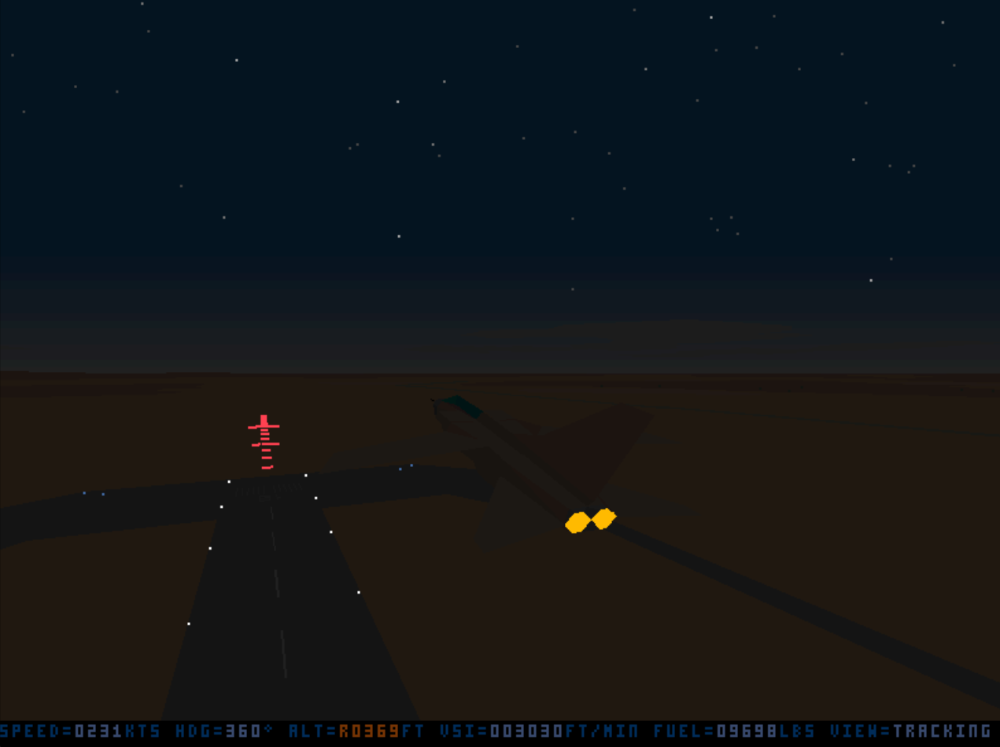
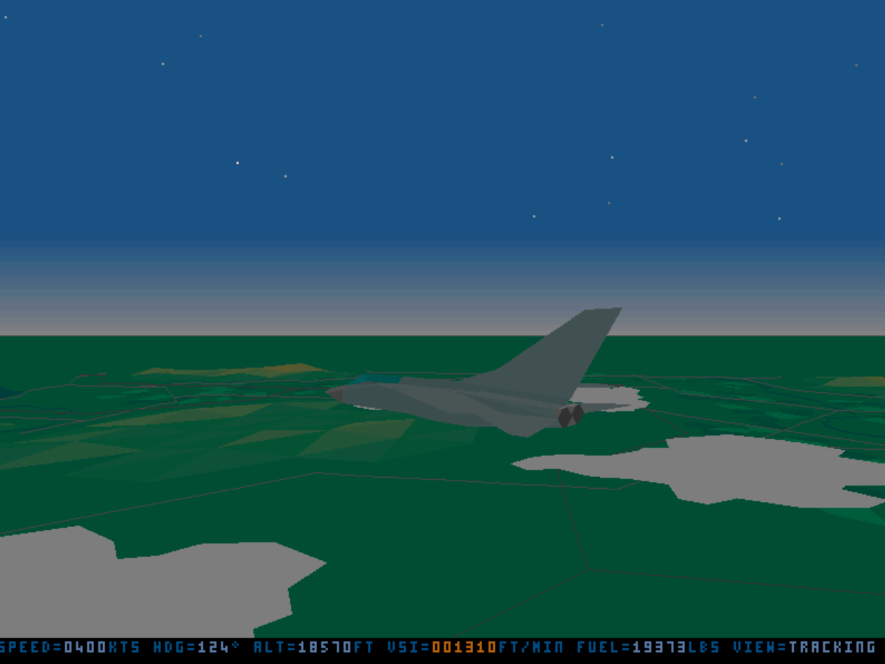
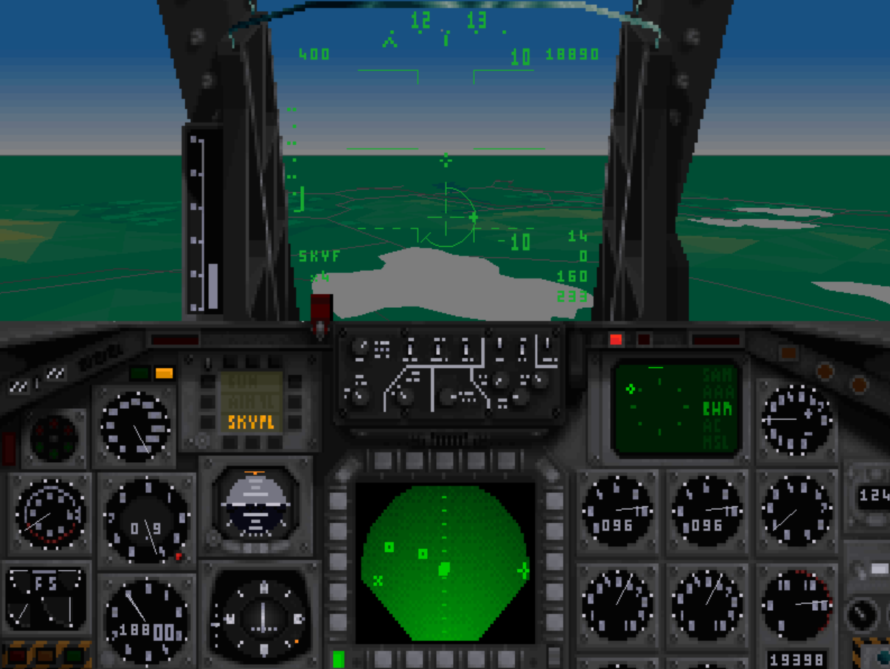
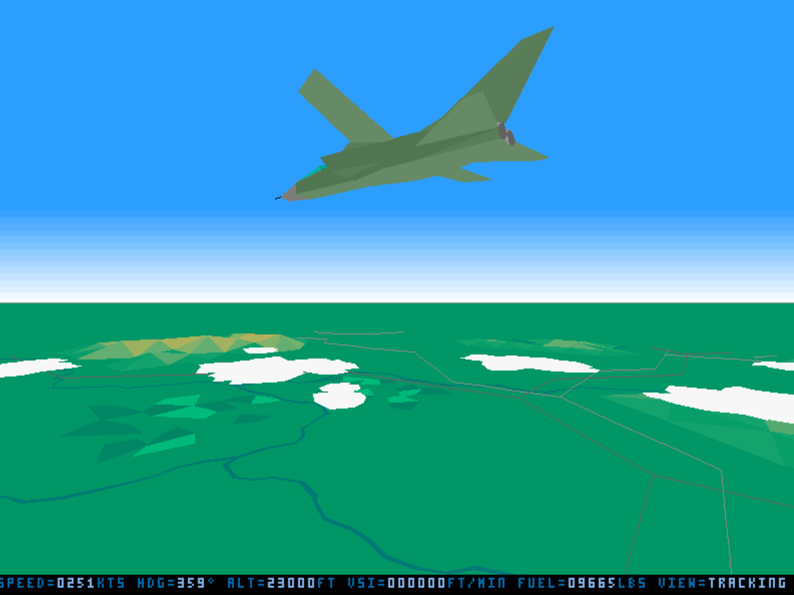
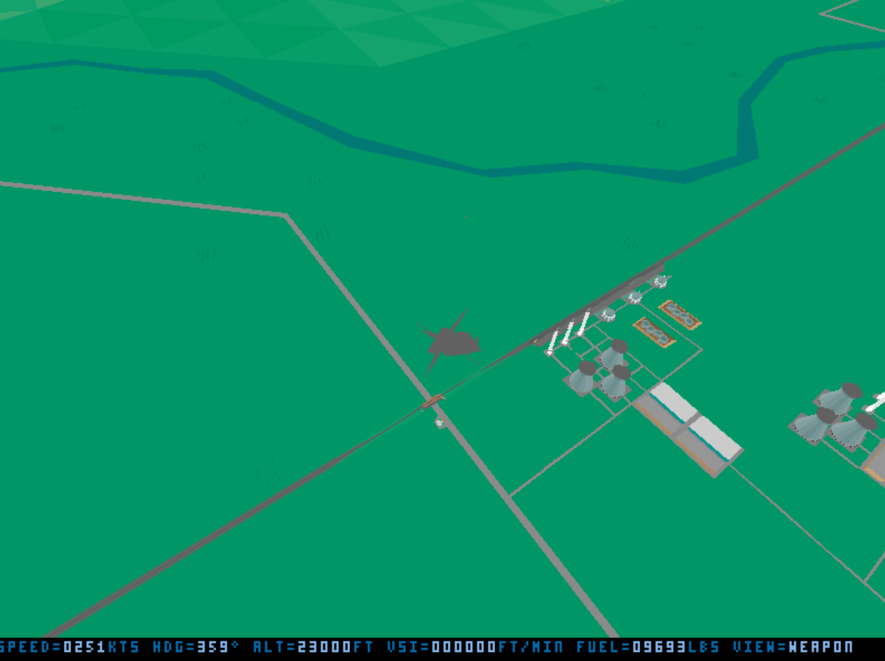
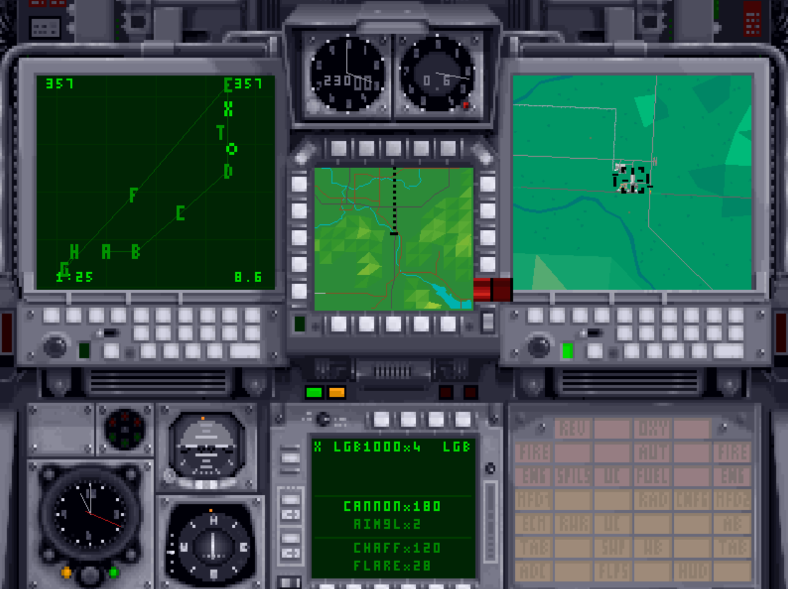
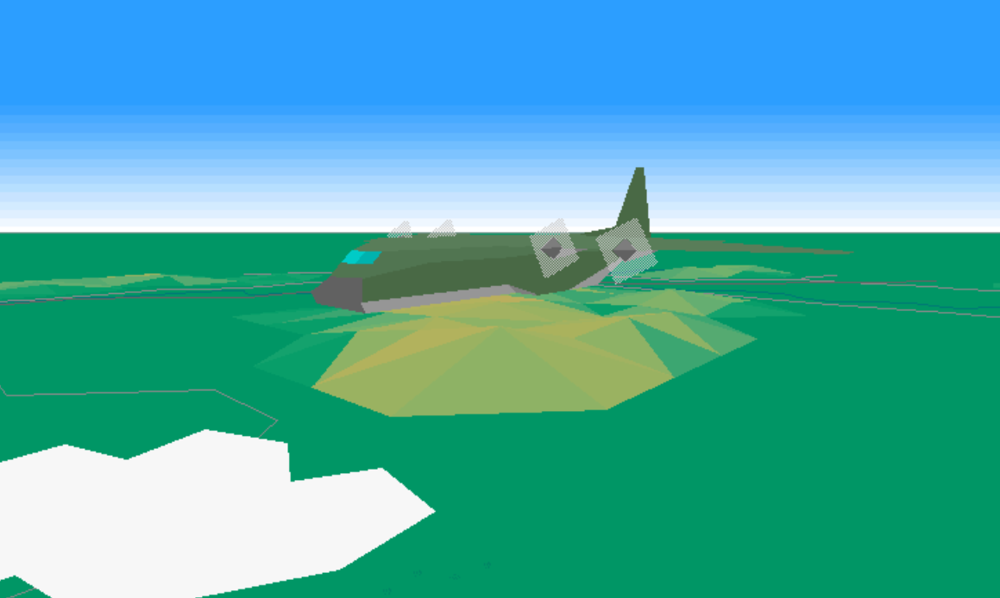

# SVGA Tornado: Digital Integration Tornado & Desert Storm in High-Resolution 800x600 VESA

[](https://github.com/amalahama/SVGA-Tornado-Release)
[](https://github.com/amalahama/SVGA-Tornado-Release)
[](https://github.com/amalahama/SVGA-Tornado-Release)
[](https://github.com/amalahama/SVGA-Tornado-Release)
[](https://paypal.me/amalahama)

Welcome to the official release repository for the **SVGA High-Resolution Port of Digital Integration's Tornado & Operation Desert Storm**

This package contains the drop-in replacement archive **`Release 1.1.zip`** with all binary files and high-definition cockpit panels required to upgrade your original copy of Tornado from standard 320x200 Mode 13h to **800x600 256-color VESA SVGA** with fluid **50 FPS flight physics**, tear-free hardware double-buffering, and extensive visual refinements.

---

## Screenshots

<p align="center">
  
  
</p>
<p align="center">
  
  
</p>
<p align="center">
  
  
</p>
<p align="center">
  
</p>

---

## Major Enhancements & Features

* **High-Resolution 800x600 VESA Display**:
  Upgrades the visual pipeline from 320x200 to native VESA Mode 103h (800x600, 256 colors), delivering **7.5 times the pixel resolution** of the original 1993/1994 release.
* **Fluid 50 FPS Physics Integration**:
  Unlocks the simulation frame rate from its historical 16-20 FPS cap up to **50 FPS** (`MaxFrameRate = 2`) utilizing 32-bit fractional position and attitude integration.
* **Redesigned High-Definition Cockpits**:
  All 7 cockpit panel backdrops (`.BT2`) have been redesigned for 800x600 resolution:
  * Pilot Main Instrument Panel (`PILOTPAN.BT2`)
  * Navigator / WSO Tactical Console (`NAVIGPAN.BT2`)
  * Pilot & Navigator Side Panels (`PSIDEPAN.BT2`, `NSIDEPAN.BT2`)
  * Cockpit Canopy Frame (`FRAMEPAN.BT2`)
  * Auxiliary Flight Instrument Panels (`EXTRAPAN.BT2`)
  * 3D Object Preview Backdrop (`PREVIEW.BT2`)
* **Tear-Free Hardware Double Buffering (Zero-Flicker VSYNC)**:
  Uses direct VESA VBE `AX=4F07h` page flipping synchronized with the vertical retrace interval, completely removing screen tearing and CRT raster flicker.
* **Vectorial HUD & Avionics Symbology**:
  Precision-scaled Head-Up Display (HUD), Multi-Function Displays (MFD), look-down moving map, and air-to-air / air-to-ground radar sweeps adapted for high resolution.
* **Enhanced Environmental & Combat Effects**:
  * Multi-stage sky gradient palettes for dawn, day, dusk, and night.
  * Rebuilt high-density night sky starfield matching original visual depth.
* **Dual-Theater Support**:
  Includes standalone executables for both the **European Theater** (`FLIGHT.EXE`) and the **Operation Desert Storm** Gulf War expansion (`DESERT.EXE`).

---

## What's New in Release 1.1

* **Aircraft Photo Decompression Fix (Review Mode)**:
  Fixed 4-bit delta decompression in `UnpackDeltaPic` by preserving the nibble phase mask (`ah`) and running delta accumulator (`bl`) across rows, eliminating horizontal static and displaying digitized aircraft photos (`.PT2`) in crisp high-definition 800x600.
* **Review Mode 3D / 2D Cockpit Layout**:
  Updated the combined 3D model viewport and scaled 2D tactical preview console to 800x120 with VESA bank routing.
* **Compass & Cardinal Points Realignment (Explorer & Map Views)**:
  Corrected line and tick mark coordinate scaling ($2.5\times$ horizontal, $3.0\times$ vertical) on the tactical compass, keeping cardinal points ('N', 'S', 'E', 'W') perfectly centered around the compass ring.

---

## Release Package: `Release 1.1.zip`

All replacement files are packaged together into **`Release 1.1.zip`** (also mirrored as `Release1.1.zip`) (~605 KB compressed / 4.6 MB uncompressed):

* **`FLIGHT.EXE`**: European Theater SVGA 800x600 executable
* **`DESERT.EXE`**: Desert Storm Theater SVGA 800x600 executable
* **`PILOTPAN.BT2`**: Pilot Front Cockpit Panel (800x600 256-color)
* **`NAVIGPAN.BT2`**: Navigator / WSO Tactical Radar Console (800x600)
* **`PSIDEPAN.BT2`**: Pilot Left/Right Side Console (800x600)
* **`NSIDEPAN.BT2`**: Navigator Left/Right Side Console (800x600)
* **`FRAMEPAN.BT2`**: Cockpit Canopy Arch and Glass Frame (800x600)
* **`EXTRAPAN.BT2`**: Auxiliary Instruments & Warning Panel (800x600)
* **`PREVIEW.BT2`**: 3D Object Viewer Backdrop (800x600)
* **`DOSBOX_RECOMMENDATIONS.txt`**: Performance and audio tuning guide

---

## Installation Guide

### Prerequisites
You need an existing, working installation of **Digital Integration Tornado CD-ROM** (or floppy 1.0e) and **Operation Desert Storm**.

### Step 1: Download `Release 1.1.zip`
Download **`Release 1.1.zip`** from this repository.

### Step 2: Backup Original Files *(Recommended)*
Before extracting, create a backup copy of your original 320x200 files inside your game's `FLIGHT\` folder:
* `FLIGHT.EXE`
* `DESERT.EXE` *(if Desert Storm is installed)*
* All 7 original `.BT2` files (`PILOTPAN.BT2`, `NAVIGPAN.BT2`, `PSIDEPAN.BT2`, `NSIDEPAN.BT2`, `FRAMEPAN.BT2`, `EXTRAPAN.BT2`, `PREVIEW.BT2`)

### Step 3: Extract into `FLIGHT\`
Extract all files from **`Release 1.1.zip`** directly into the `FLIGHT\` directory of your Tornado installation (e.g. `C:\TORNADO\FLIGHT\` or `D:\TORNADO.CD\FLIGHT\`), replacing the existing files when prompted.

### Step 4: Run the Simulation
Launch Tornado through DOSBox using your regular launcher (e.g. `T.BAT`, `GO.BAT`, or direct executable invocation).

---

## Recommended DOSBox Configuration (`dosbox.conf`)

Rendering 800x600 at 50 FPS requires 7.5x the pixel fillrate of the original game. In DOSBox, uncalibrated CPU cycles or default audio buffer sizes can cause audio stuttering (*buffer underrun*) during polygon-heavy scenes (low-altitude flight, complex airbases, horizon gradients).

To achieve **rock-solid 50 FPS** with **crystal-clear, stutter-free audio**, update your `dosbox.conf` with these settings:

```ini
[cpu]
core=dynamic
cputype=pentium
cycles=fixed 95000
# IMPORTANT: Avoid 'cycles=max'. Unbounded max cycles starves the host audio thread
# and produces audio crackling. A fixed setting between 70000 and 95000 ensures
# rock-solid 50 FPS with consistent timing. If dynamic cycles are preferred, use:
# cycles=max 85%

[mixer]
rate=48000
blocksize=2048
prebuffer=70
# IMPORTANT: 
# - 'rate=48000' matches modern Windows WASAPI native rate, eliminating resampling overhead.
# - 'blocksize=2048' (default is 1024) provides latency headroom during 3D rendering spikes.
# - 'prebuffer=70' (default is 20 ms) is vital: at 50 FPS, one frame takes 20 ms.
#   Setting prebuffer to 70 ms provides a 3-4 frame safety cushion.

[sblaster]
sbtype=sb16
sbbase=220
irq=7
dma=1
hdma=5
sbmixer=true
oplmode=opl3
oplrate=48000
# NOTE: 'oplrate=48000' must match the mixer rate to avoid internal OPL resampling.

[sdl]
output=opengl
# NOTE: Hardware-accelerated video blitting delegates 800x600 scaling to your GPU.

[render]
scaler=none
# NOTE: NEVER use CPU software scalers (such as normal2x, hq) on 800x600 SVGA.
```

### Recommended DOSBox Flavors
1. **[DOSBox-Staging](https://dosbox-staging.github.io/) (Highly Recommended)**:
   Includes a modern SDL2 multithreaded audio engine with dynamic rate control that completely prevents audio clicks, pops, and underruns.
2. **[DOSBox-X](https://dosbox-x.com/)**:
   Full-featured emulator with native high-resolution VESA support and dedicated audio thread options (`audiothread=true`).
3. **Vanilla DOSBox 0.74-3 / ECE**:
   Works flawlessly with the tuned `[mixer]` and `[cpu]` configuration detailed above.

---

## In-Game Command-Line Switches

You can pass command-line switches to `FLIGHT.EXE` and `DESERT.EXE`:

| Switch | Function | Example |
| :--- | :--- | :--- |
| `/a` | Start mission directly airborne (in flight) | `FLIGHT.EXE /a` |
| `/qs` | Quick Start mission (Airborne + Invulnerability) | `DESERT.EXE /qs` |
| `/sb` | Enable Sound Blaster digitized audio + AdLib FM | `FLIGHT.EXE /a /sb` |
| `/sa` | Enable pure AdLib FM audio (lightest CPU load) | `FLIGHT.EXE /a /sa` |
| `/va` | Fly the Tornado ADV (Air Defence Variant) | `FLIGHT.EXE /va` |
| `/p` | 3D Object / Aircraft model viewer mode | `DESERT.EXE /p` |
| `/nc` | No mid-air or terrain collisions (debugging) | `FLIGHT.EXE /a /nc` |

---

## Support & Donations

If you appreciate this modernization project and would like to support continued preservation, optimization, and reverse-engineering of classic flight simulations, donations are gratefully accepted via PayPal:

<p align="center">
  <a href="https://paypal.me/amalahama">
    
  </a>
</p>

Thank you for keeping one of the greatest military flight simulators ever created flying high!
